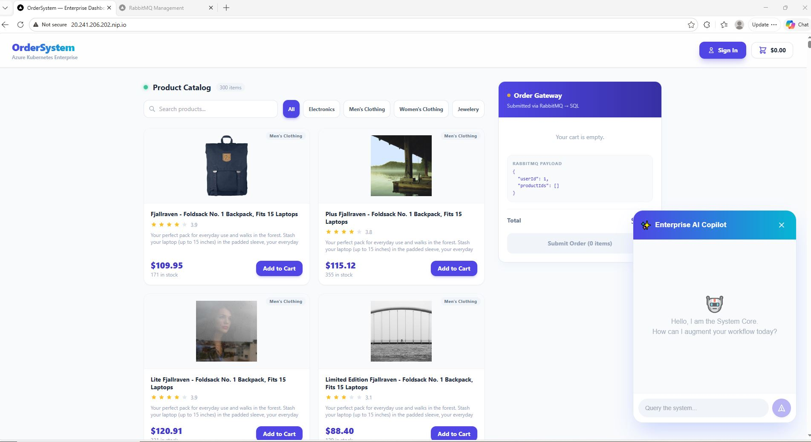

# I vibe code a Mini-Amazon with Antigravity 🚀

A high-performance, event-driven microservices ecosystem demonstrating the architectural journey from a monolithic foundation to an elastic, Kubernetes-orchestrated cloud platform.

<p align="left">
  
  
  
  
  
  
</p>

**Live Application Demo:** [http://20.241.206.202.nip.io/](http://20.241.206.202.nip.io/)

---

## 📖 The Motivation

Recently, I built a ChatGPT app in under 30 minutes. The momentum and excitement of that rapid development were incredible, and I wanted to channel that energy into something truly interesting.

Dreaming is free, so I figured I might as well dream big. Rather than following standard Microsoft tutorials to build yet another simple ToDo list, I decided to aim much higher. Not many developers have a chance to work on massive applications like Amazon, so scalability is something everyone "knows" but most never experience building firsthand. I set out to build the foundational architecture for the next Amazon: a highly scalable, distributed Order System.

---

## 🏗️ Phase-by-Phase Architecture Evolution

Scaling a system is rarely achieved in a single leap. By progressively iterating the architecture, I could clearly observe the trade-offs of each pattern.

### Phase 1: The Monolithic Foundation
I started exactly where you'd expect: a standard C# Web API utilizing **SQL Server** and **Entity Framework (EF) Core**. I explicitly introduced the **Repository Pattern** because I wanted to decouple the core business logic from the data access layer.

For instance, entity-specific logic like `GetActiveOrders()` is centralized in the repository, rather than having LINQ queries scattered and duplicated across the entire API. But the paramount advantage is **testability**. By using this abstraction, I unlocked the ability to easily "Mock" the database. During unit testing, we can instantly swap the physical SQL repository for a "Fake" in-memory list, rendering the testing pipelines **100x faster**.

### Phase 2: Containers & Redis 🐳
After building the foundation, I inevitably faced the classic developer dilemma: "It works on my machine." To permanently resolve deployment inconsistencies, we implemented **Docker** containerization.

Setting up the container environment was a breeze with an assist from Antigravity. Because I'm targeting Amazon-level scale, I had to proactively anticipate bottlenecks. If millions of users simultaneously hit the homepage, routing 100% of that read traffic directly to SQL Server will instantly exhaust connection pools. By spinning up **Redis** inside its own container, I established a scalable **Distributed Cache**. I implemented the industry-standard **Cache-Aside Pattern**: when a client requests the catalog, the application first queries Redis. On a hit, it serves the payload in sub-milliseconds.

### Phase 3: Message Broker (RabbitMQ) 🐇
One of the most important aspects of any application is responsiveness. I never want a user to wait unnecessarily. A proven technique to solve this is introducing a **Message Broker**.

While Kafka is often the default choice, I chose **RabbitMQ** for its **"Smart Broker"** architecture. RabbitMQ handles complex routing logic via "Exchanges," ensuring messages are delivered exactly where they need to go. In our case, the application is instantly responsive: the frontend receives an **HTTP 202 Accepted** response immediately upon checkout, ensuring zero UI lag. Meanwhile, the backend publishes an `OrderSubmittedEvent` to RabbitMQ for background fulfillment.

### Phase 4: Microservices or Not Microservices ✂️
One of the most debated topics in our industry is the necessity of Microservices. Most of us start with monolithic applications; the ease of reasoning and rapid debugging make it hard to leave. At this stage, I could have deployed my application in a single container just fine. However, because the goal was to build a truly resilient system, I decided to embrace the complexity.

**The Accidental Discovery: Fault Isolation**
While breaking the app out into microservices—assigning a separate container for each—I actually misconfigured the Order service. It was throwing exceptions in the background, but on the frontend, I didn't even notice at first. I could still browse the catalog and navigate the app perfectly; everything seemed fine until I hit the "Submit" button. That’s how I truly discovered the power of this architecture. By physically decoupling the services, a total failure in the ordering pipeline didn't take down the rest of the user experience. This establishes a **"Blast Radius"** for errors that can save your skin in production.

### Phase 5: Kubernetes Orchestration ☸️
At this point, the system felt scalable on paper, but I knew it wasn't "Black Friday ready." I needed infrastructure that breathes.

I originally planned to deploy to Google Cloud (GKE), but as a "broke developer" on a budget, I pivoted to **Azure Kubernetes Service (AKS)** to make the most of my Microsoft student credits. Instead of manually guessing how many instances I need, I implemented **Horizontal Pod Autoscaling (HPA)**. Kubernetes acts like a digital foreman, monitoring CPU saturation in real-time. During a traffic surge, it "organically" clones my containers—spinning up 10 replicas—and gracefully terminates them when the load dies down.

**The Database Reality Check:**
Scaling the application pods is only half the battle. You can’t just "clone" a database 10 times as easily. This is where the RabbitMQ architecture from Phase 3 really shines. The message broker acts as a **"pressure-relief valve"** — holding the orders in a queue so the database can process them at its own pace without crashing.

### Phase 6: Full-Stack & Final Touches ⚛️
With a robust, distributed backend in place, I chose **Next.js** and **React** for the frontend. Integrated **Google OAuth**, which turned out to be surprisingly seamless when paired with Next.js and .NET Core.

**The nip.io "Broke Dev" Trick:**
I should have bought a beautiful domain name, which is actually a requirement to use the Google API. But since I'm a truly broke dev, I used the trick of putting the raw Azure IP through **.nip.io** to bypass the domain requirement.

**Transparent Shopping Cart:**
Instead of a boring "Item Added" message, I decided to show the actual **JSON payload** being fired off to the RabbitMQ exchange. Seeing the raw data leave the client and enter the distributed pipeline in real-time is much more satisfying than a standard loading spinner.

---

### 🤖 Intelligent Assistance: AI Copilot
The platform features an integrated **AI Copilot** designed to provide contextual support and streamline the user experience within the dashboard ecosystem.

- **Engine**: Powered by **Google Gemini 1.5 Flash** (leveraging the `@ai-sdk/google` library).
- **Functionality**: Provides real-time, streaming assistance for navigation, order inquiries, and system-level support.
- **Architectural Integration**: Implemented via a streaming POST route in Next.js, utilizing server-side environment variables for secure API key management and decoupled frontend-backend communication.

---

## 🔍 The Roadmap Ahead: Phase 7
While the system is robust, a distributed architecture is "blind" without Observability. My next steps involve:
- **Centralized Logging**: Using Serilog and Azure Monitor.
- **Audit System**: Building a dedicated service to consume events and keep a history of order state changes.
- **Health Checks**: Fine-tuning Kubernetes liveness and readiness probes.

---

## 🛠️ Technology Stack
| Layer | Technologies |
|---|---|
| **Backend** | .NET 9, Entity Framework Core, SQL Server |
| **Frontend** | Next.js 14, React, Tailwind CSS |
| **Messaging** | MassTransit, RabbitMQ |
| **Caching** | Redis |
| **Security** | NextAuth.js (Google OAuth, JWT Credentials) |
| **Infra** | Docker, Kubernetes (AKS/Nginx Ingress) |

---

## 🚀 Local Deployment Guide

### 1. Prerequisites
- [Docker Desktop](https://www.docker.com/products/docker-desktop/) (Kubernetes enabled)
- [kubectl](https://kubernetes.io/docs/tasks/tools/)
- [.NET 9.0 SDK](https://dotnet.microsoft.com/download/dotnet/9.0)

### 2. Configure Environment
Create `k8s/ui/nextjs-auth-patch.yaml` with your Google OAuth credentials:
```yaml
apiVersion: v1
kind: Secret
metadata:
  name: nextjs-auth
type: Opaque
stringData:
  NEXTAUTH_SECRET: "your_secret_hash"
  NEXTAUTH_URL: "http://localhost"
  GOOGLE_CLIENT_ID: "your_id"
  GOOGLE_CLIENT_SECRET: "your_secret"
```
Apply the secret: `kubectl apply -f k8s/ui/nextjs-auth-patch.yaml`

### 3. Build & Deploy
```bash
# Build local images
docker build -f Catalog.Api/Dockerfile -t ordersystem/catalog-api:latest .
docker build -f OrderSystem.Api/Dockerfile -t ordersystem/ordersystem-api:latest .
docker build -t ordersystem/ordersystem-ui:latest ordersystem-ui

# Provision Infrastructure
kubectl apply -f k8s/database/
kubectl apply -f k8s/caching/
kubectl apply -f k8s/messaging/
kubectl apply -f k8s/api/
kubectl apply -f k8s/ui/
kubectl apply -f k8s/load-balancer/
```

Access the application at **`http://localhost`**.

---

## 📸 System Previews

<p align="center">
  
</p>
<p align="center">
  
  
</p>
<p align="center">
  
  
</p>

---

## 📜 License
This project is licensed under the MIT License.
