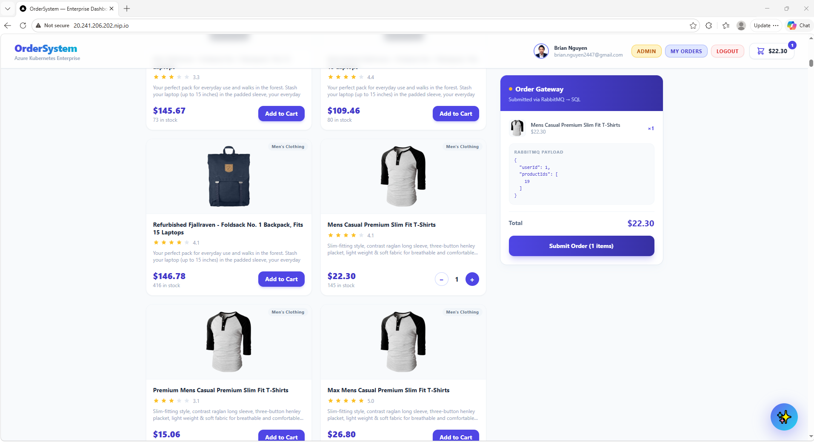
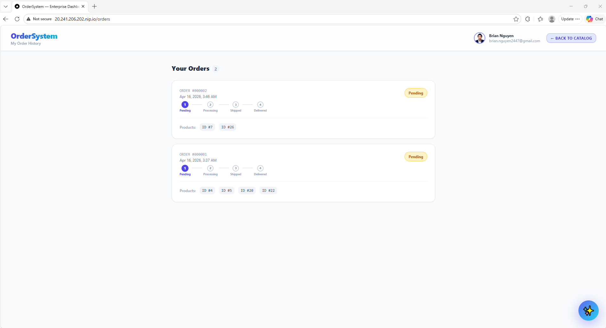
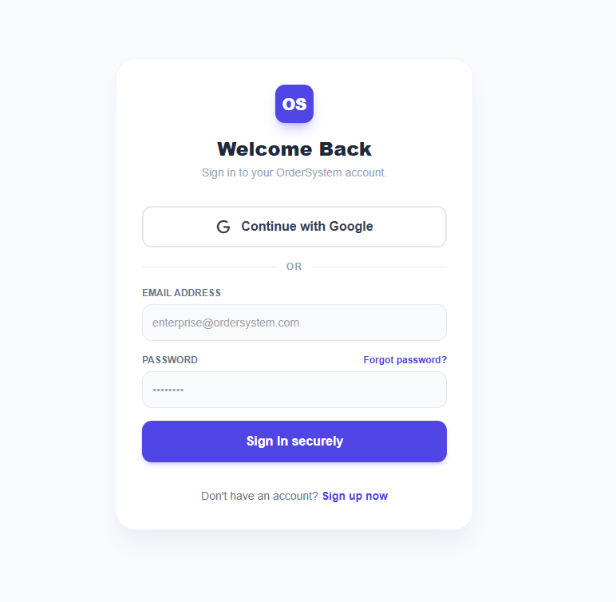
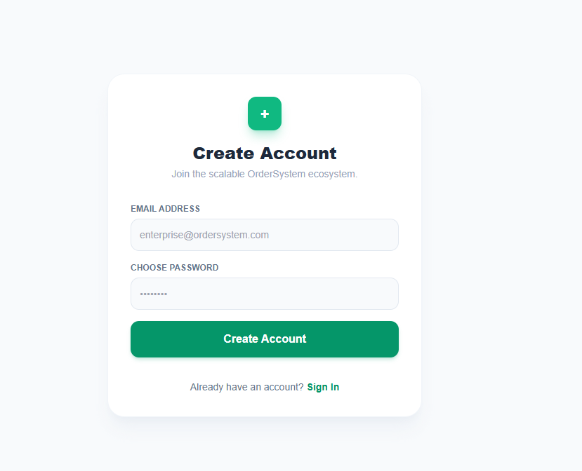
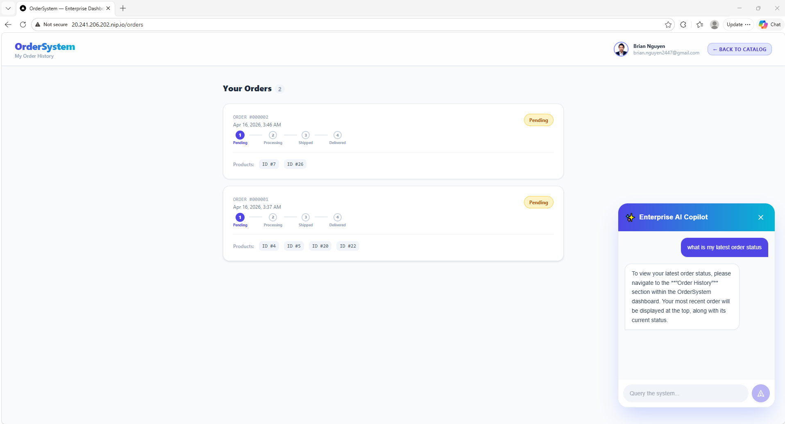
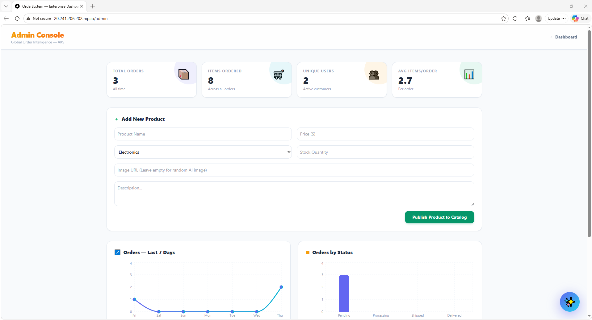

<div align="center">
  <h1>🚀 Enterprise Order System</h1>
  <p>A highly scalable, distributed microservices architecture built to demonstrate modern e-commerce engineering, from monolithic foundations to Kubernetes auto-scaling.</p>

  <!-- Badges -->
  
  
  
  
  
</div>

<br/>

<div align="center">
  <strong>🔴 Live Demo Application:</strong> <a href="http://20.241.206.202.nip.io/">http://20.241.206.202.nip.io/</a>
</div>

<br/>

## 📖 Overview

The **Enterprise Order System** is a full-stack, distributed application designed to seamlessly handle massive retail scale—emulating the exact patterns used by e-commerce giants. It separates standard catalog browsing from deep transactional order processing using highly resilient queue-based architecture.

### ✨ Key Features
- **Distributed Microservices**: Dedicated `Catalog.Api` and `OrderSystem.Api` ensuring high availability.
- **Asynchronous Processing**: **RabbitMQ** event bus guaranteeing absolutely zero data loss during high-traffic order spikes.
- **Lightning Fast Caching**: **Redis** implemented to heavily optimize database hits.
- **Enterprise Authentication**: Bespoke NextAuth integration gracefully supporting both traditional **Email/Password** and **Google Sign-In**.
- **AI Copilot Chatbot**: Native intelligent assistant embedded in the UI to guide users.
- **Dynamic Auto-Scaling**: Engineered for Kubernetes (AKS) to organically spin-up replicas during simulated "Black Friday" events.

---

## 📸 Application Gallery

To visualize the system's modularity and frontend aesthetic, here are a few core workflows:


<br>

<br>

<br>

<br>

<br>


---

## 🛠️ Tech Stack & Architecture

- **Backend**: C# .NET 8 Web APIs, Entity Framework Core, SQL Server
- **Frontend**: Next.js 14, React, Tailwind CSS, TypeScript
- **Messaging Pipeline (Event-Driven)**: MassTransit & RabbitMQ
- **Caching**: Redis
- **Authentication**: NextAuth.js (Google OAuth & JWT Credentials)
- **Infrastructure**: Docker Desktop, Kubernetes (AKS/Minikube), Nginx Ingress Controller

---

## 🚀 Getting Started

To spin up your own instance of the Enterprise Order System locally, follow these highly detailed deployment steps.

### Prerequisites
Before you start, ensure you have the following installed on your machine:
1. [Docker Desktop](https://www.docker.com/products/docker-desktop) (With **Kubernetes** explicitly enabled in the settings).
2. `kubectl` CLI tool.
3. Node.js (v20+) & NPM.
4. .NET 8.0 SDK.

---

### Step 1: Obtain Google OAuth Secrets
To enable the **Google Sign-In** integration, you must configure a Google Platform Application.

1. Go to the [Google Cloud Console](https://console.cloud.google.com/).
2. Create a New Project.
3. Navigate to **APIs & Services** > **Credentials**.
4. Click **Create Credentials** > **OAuth client ID**. 
   - Set Application Type to **Web Application**.
   - Add Authorized JavaScript Origins: `http://localhost:3000` (and your remote IP if deploying).
   - Add Authorized Redirect URIs: `http://localhost:3000/api/auth/callback/google`
5. Save the generated **Client ID** and **Client Secret**.

### Step 2: Configure Environment Variables

Create a Kubernetes Secret manifest (or inject them directly) to feed NextAuth securely locally.

In the root of the project, define your credentials so the cluster can read them. Inside `k8s/ui/nextjs-auth-patch.yaml`, update the Base64 equivalents of your tokens:

```yaml
apiVersion: v1
kind: Secret
metadata:
  name: nextjs-auth
type: Opaque
stringData:
  NEXTAUTH_SECRET: "generate_a_random_cryptographic_string_here"
  NEXTAUTH_URL: "http://localhost:3000"
  GOOGLE_CLIENT_ID: "your_google_client_id_here"
  GOOGLE_CLIENT_SECRET: "your_google_client_secret_here"
```

Apply the secret to your cluster:
```bash
kubectl apply -f k8s/ui/nextjs-auth-patch.yaml
```

### Step 3: Build the Docker Images
You need to individually containerize the microservices. Open your terminal at the root path of the project:

```bash
# 1. Build the Catalog API
docker build -f Catalog.Api/Dockerfile -t ordersystem/catalog-api:latest .

# 2. Build the Order System API
docker build -f OrderSystem.Api/Dockerfile -t ordersystem/ordersystem-api:latest .

# 3. Build the Next.js Frontend
docker build -t ordersystem/ordersystem-ui:latest ordersystem-ui
```

*(Note: Depending on your Docker setup, you may need to map these to your personal DockerHub repository by prefixing the image tags with `yourusername/` and pushing them).*

### Step 4: Deploy Kubernetes Infrastructure
The project maintains a massive suite of declarative Kubernetes YAML templates inside the `/k8s` directory. They spin up SQL Server, RabbitMQ, Redis, all the microservices, and configure the internal networking pipelines.

Apply them systematically:

```bash
# 1. Stand up the persistent databases and orchestrators (SQL, Redis, RabbitMQ)
kubectl apply -f k8s/database/
kubectl apply -f k8s/messaging/
kubectl apply -f k8s/caching/

# 2. Deploy the core business logic microservices
kubectl apply -f k8s/api/

# 3. Deploy the Next.js Client User Interface
kubectl apply -f k8s/ui/

# 4. Deploy the Nginx Ingress Controller (Load Balancer)
kubectl apply -f k8s/load-balancer/
```

### Step 5: Test the Application!

Once all pods are displaying dynamically as `Running` via `kubectl get pods`, the Nginx Ingress will expose the application externally.

1. **Main UI**: Navigate to `http://localhost` (or the IP delegated by your cluster ingress).
2. **RabbitMQ Dashboard**: You can monitor queues securely by port-forwarding:
   `kubectl port-forward svc/rabbitmq 15672:15672`
   Access it at `http://localhost:15672` (Username: `guest` / Password: `guest`).

Enjoy exploring the Enterprise Order System! Validate scalability by hitting the endpoints programmatically and watching RabbitMQ process the transactions asynchronously in real-time.
